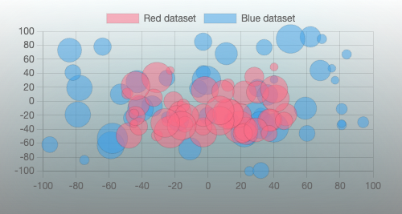

# Bubble Chart 

## How to use

import

```typescript
import BubbleChart from ‘./../../uikit/ui/BubbleChart'
```
---
所需掛件
- chart.js
- react-chartjs-2
---
若未有明確數據，僅單純呈現圖表效果，而拷貝使用此範例的資料格式作為參數時，
則需另外安裝 **@faker-js/faker** （一般使用情況不需要此掛件）

---


參數定義
```typescript
interface BubbleChartProps {
  dataList: {
    label: string //數據名稱
    data: { x: number //x軸位置
            y: number //y軸位置
            r: number //半徑
          }[] //個別數據陣列
    backgroundColor: string //圖形顏色
  }[]
  maxSize: number //圖表最大尺寸
  padding: number //內間距
  bgShow?: boolean //背景顯示與否
  bgHalo?: boolean //光暈顯示與否
  theme?: string //主題 dark/light
}
```
---
資料格式範例
```typescript
import { faker } from '@faker-js/faker'

const bubbleData = [
  {
    label: 'Red dataset',
    data: Array.from({ length: 50 }, () => ({
      x: faker.number.int({ min: -50, max: 50 }),
      y: faker.number.int({ min: -50, max: 50 }),
      r: faker.number.int({ min: 5, max: 20 }),
    })),
    backgroundColor: 'rgba(255, 99, 132, 0.5)',
  },
  {
    label: 'Blue dataset',
    data: Array.from({ length: 50 }, () => ({
      x: faker.number.int({ min: -100, max: 100 }),
      y: faker.number.int({ min: -100, max: 100 }),
      r: faker.number.int({ min: 5, max: 20 }),
    })),
    backgroundColor: 'rgba(53, 162, 235, 0.5)',
  },
]
```
---


```typescript
return (
  <BubbleChart
      dataList={bubbleData}
      maxSize={500}
      padding={15}
      bgShow={true}
      bgHalo={true}
      theme="dark"
  />
)
```
---

Snapshot

