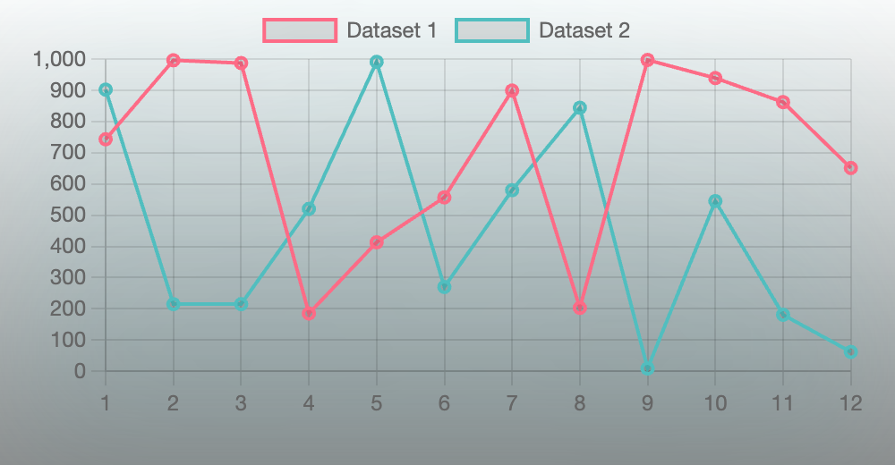

# Line Chart

## How to use

import

```typescript
import LineChart from ‘./../../uikit/ui/LineChart'
```

---
所需掛件
- sass
- chart.js
- react-chartjs-2
---
若未有明確數據，僅單純呈現圖表效果，而拷貝使用此範例的資料格式作為參數時，
則需另外安裝 **@faker-js/faker** （一般使用情況不需要此掛件）

---

參數定義

```typescript
interface LineChartProps {
  labels: string[]
  dataList: {
    label: string //數據名稱
    data: number[] //個別數據陣列
    borderColor: string //折線顏色
    borderWidth: number //折線寬度
  }[]
  maxSize: number //圖表最大尺寸
  padding: number //內間距
  bgShow?: boolean //背景顯示與否
  bgHalo?: boolean //光暈顯示與否
  theme?: string //主題 dark/light
}
```

---

資料格式範例

```typescript
import { faker } from '@faker-js/faker'
const labelsList = ['January', 'February', 'March', 'April', 'May', 'June', 'July']

const lineChartData = [
  {
    label: 'Dataset 1',
    borderColor: 'rgb(255, 99, 132)',
    borderWidth: 2,
    data: labelsList.map(() => faker.number.int({ min: 0, max: 1000 })),
  },
  {
    label: 'Dataset 2',
    borderColor: 'rgb(75, 192, 192)',
    borderWidth: 2,
    data: labelsList.map(() => faker.number.int({ min: 0, max: 1000 })),
  },
]
```

---

```typescript
return (
  <LineChart
    labels={labelsList}
    dataList={lineChartData}
    maxSize={500}
    padding={15}
    bgShow={true}
    bgHalo={true}
    theme="dark"
  />
)
```

---

Snapshot


