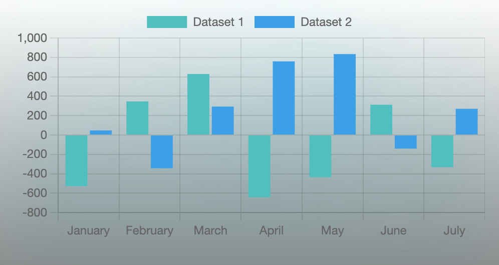

# Vertical Bar Chart

## How to use

import

```
import VerticalBarChart from ‘./../../uikit/ui/VerticalBarChart'
```
---
所需掛件
- sass
- chart.js
- react-chartjs-2
---
若未有明確數據，僅單純呈現圖表效果，而拷貝使用此範例的資料格式作為參數時，
則需另外安裝 **@faker-js/faker** （一般使用情況不需要此掛件）

---

參數定義

```
interface VerticalBarChartProps {
  labels: string[]
  dataList: {
    label: string //數據名稱
    data: number[] //個別數據陣列
    backgroundColor: string //長條底色
  }[]
  maxSize: number //圖表最大尺寸
  padding: number //內間距
  bgShow?: boolean //背景顯示與否
  bgHalo?: boolean //光暈顯示與否
  theme?: string //主題 dark/light
}
```

---

資料格式範例

```
import { faker } from '@faker-js/faker'
const labelsList = ['January', 'February', 'March', 'April', 'May', 'June', 'July']

const barChartDataList = [
  {
    label: 'Dataset 1',
    backgroundColor: 'rgb(53, 162, 235)',
    data: labelsList.map(() => faker.number.int({ min: -1000, max: 1000 })),
  },
  {
    label: 'Dataset 2',
    backgroundColor: 'rgb(75, 192, 192)',
    data: labelsList.map(() => faker.number.int({ min: -1000, max: 1000 })),
  },
]
```

---

```
<VerticalBarChart
  labels={labelsList}
  dataList={barChartDataList}
  maxSize={500}
  padding={15}
  bgShow={true}
  bgHalo={true}
  theme="dark"
/>
```

---

Snapshot


