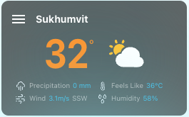

# WeatherPanel

## How to use

import
```typescript
import WeatherPanel from ‘./../../uikit/ui/WeatherPanel'
```
---
所需掛件
- moment
---

參數定義
```typescript
interface WeatherPanelProps {
  dt: number //時間戳，單位為'秒數'
  clouds?: number //雲量百分比
  coord?: { lon: number; lat: number } // 經緯度
  feels_like: number //體感溫度
  temp: number //溫度
  temp_min?: number //最低溫
  temp_max?: number //最高溫
  pressure?: number //氣壓
  humidity: number //濕度
  precipitation?: {
    value: number //降水量
    mode: string //降水型態(rain / snow)
  }
  city_name: string //城市名
  country?: string //國家
  sunrise?: number //日出時間戳(單位：秒)
  sunset?: number //日落時間戳(單位：秒)
  timezone?: number //時區代碼
  visibility?: number //能見度
  weather: {
    id: number //天氣狀態id //https://openweathermap.org/weather-conditions#Weather-Condition-Codes-2
    main: string //天氣狀態
    description: string //天氣狀態描述
    icon: string //天氣狀態圖標
  }
  wind: {
    speed: number //風速
    deg: number //風向
    gust?: number //陣風風速
  }
}

```

---

資料格式範例

```typescript
const weather = {
  "dt": 1683721925,
  "coord": { "lon": 100.5714, "lat": 13.7342 },
  "weather": { "id": 801, "main": "Clouds", "description": "few clouds", "icon": "02n" },
  "temp": 31.86,
  "feels_like": 36.17,
  "temp_min": 30.93,
  "temp_max": 32.94,
  "pressure": 1007,
  "humidity": 58,
  "visibility": 10000,
  "wind": { "speed": 3.09, "deg": 200 },
  "clouds": 20,
  "timezone": 25200,
  "sunrise": 1683672775,
  "sunset": 1683718524,
  "country": "TH",
  "city_name": "Sukhumvit"
}
```

---

```typescript
return (
  <WeatherPanel weather={weather} />
)
```

---

Snapshot


